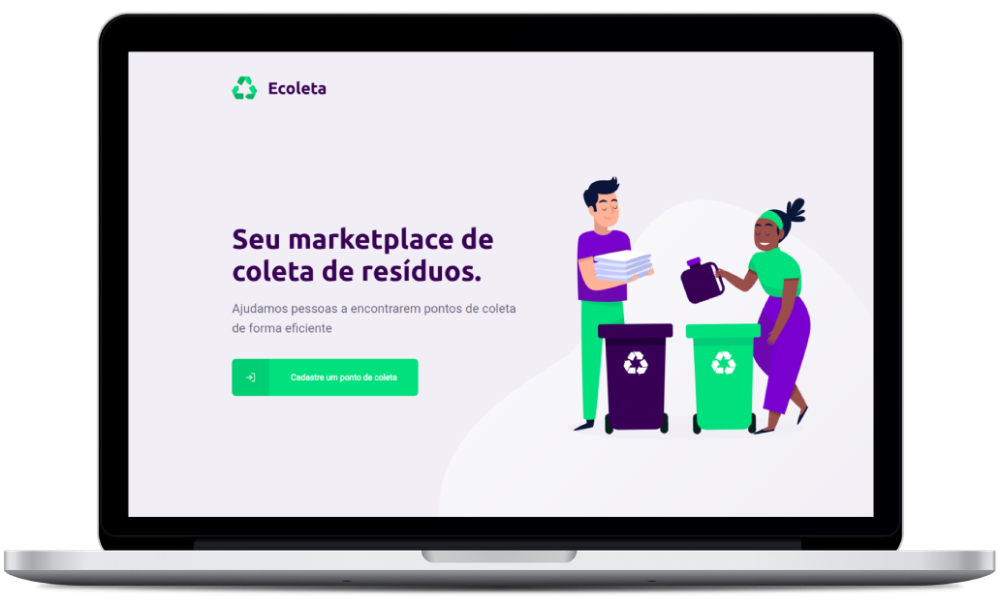
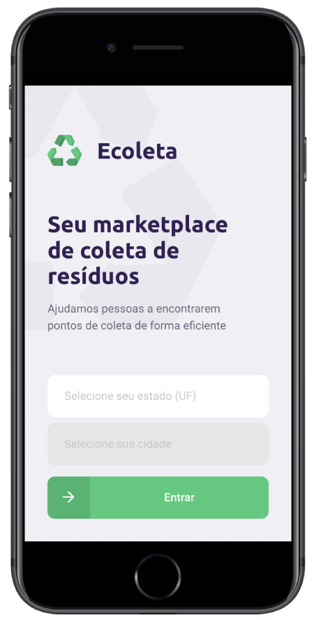

<h1 align="center">

</h1>

	
    

## Resume

React and React Native application with API REST back end. 

We purpose connect people to locations that have recyclable garbage collection points. The users can find these points using the mobile app and the geolocation.

The centers of collections can be register on web site, then offer an users diferent types of recyclable garbage points, like eletronics spots, organic waste, lamps, cooking oil and so forth.

## Screens

### Web

  

### Mobile

  

## Tecnologies

This applications was built with the following technologies.

- [Type Script](https://www.typescriptlang.org/)
- [Node.js](https://nodejs.org/en/)
- [React](https://reactjs.org)
- [React Native](https://facebook.github.io/react-native/)

## :memo: License

This project use MIT license, see the file [LICENSE](LICENSE) for more details.